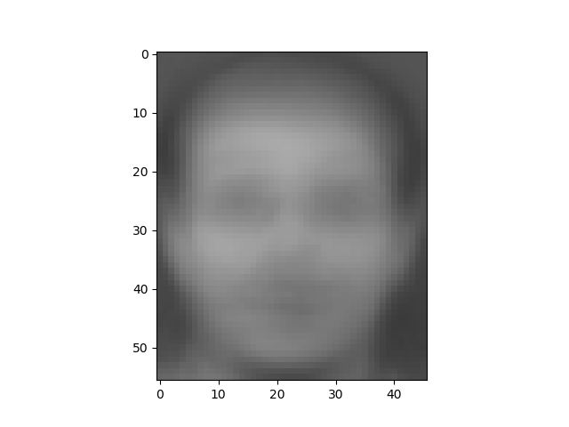
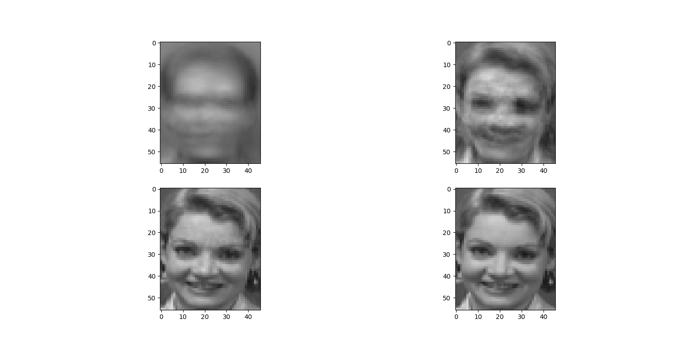

# DLCV Homework 1 Report

## Name
Name: 李華健
Student No.: B05901119

## Problem 1

Choose R = 2 as the decision region
x < 2, choose w_1

x >= 2, choose w_2

Error prob. = 2/15

## Problem 2
### Problem 2.1 PCA Mean Face and The first 4 Eigenfaces

### Problem 2.2

左上: N = 3   右上: N = 45   左下: N = 140   右下: N = 229

### Problem 2.3 Mean Sequre Error
| n   | MSE                |
| --- | ------------------ |
| 3   | 1009.8975155279503 |
| 45  | 258.18633540372673 |
| 140 | 19.14169254658385  |
| 229 | 0.5023291925465838 |

每次輸出 MSE 都會有微少的變動，但誤差不大。

### Problem 2.4 k-nearest neighbors and 2.5 Prediction
| k   | N   | Train Score | Test Score |
| --- | --- | ----------- | ---------- |
| 1   | 3   | 1.0         | 0.6        |
| 1   | 45  | 1.0         | 0.95625    |
| 1   | 140 | 1.0         | 0.94375    |
| 3   | 3   | 0.86667     | 0.56875    |
| 3   | 45  | 0.97083     | 0.88125    |
| 3   | 140 | 0.97083     | 0.8875     |
| 5   | 3   | 0.79167     | 0.49375    |
| 5   | 45  | 0.925       | 0.8375     |
| 5   | 140 | 0.9125      | 0.825      |

在Training set中最值得注意的是(k, N) = (1, 3) (1, 45), (1,140)三個情況, PCA的模型對完全吻合set的內容

但在Test set中則以(k, N) = (1, 45) 這組表現最好

整體上, k選1的準確度最高, 其次為3, 最後為5。
而N上, 多選N為45的準確度高, 其次為140, 最後為3。

意外的是，保有最多資訊的並不一定帶來最佳預測效果。

## Problem 3

### Problem 3.1

### Problem 3.2 KMeansClustering

正方形為該分堆的中心點

### Problem 3.3 BoW

每種類型的相片都會有部分突出的Visual Words，只要知道同類型的相片比較接近何種分佈，便可以利用此信息並進行分類。如Problem 3.4，分類的效果由25%(亂猜)先提升到50%左右。

類別: 左上為banana，右上為fountain，左下為reef，右下為tractor

### Problem 3.4 kNN Classification
Accuracy = 0.528

## Problem 4

### Problem 4.1
Provide a briefly prove

### Problem 4.2 Gaussian Filter

左: 原圖, 右: 經過Gaussian Filter

比對兩照片會發現人物頭髮有明顯差異，邊界被模糊化。

### Problem 4.3
I_x = np.array([0.5, 0, -0.5])

I_y = np.array([0.5, 0, -0.5]).transpose()

方法: 利用 ``np.convolve()`` 對一維陣列作卷積

圖形像素為 (512 * 512), Kernal 在卷積時會在邊界產生額外的 Pixel (514 * 514)，將其清除掉

以上為直接輸出結果，發現只有少數灰色線條，負值的部分被歸0，故往上 Shift 100 增加呈現效果，下圖為像素資訊 * 5 + 100 的結果，較容易看到人物的輪廓

### Problem 4.4 Gradient Magnitude
由於 Gaussian 的效果，邊界的差異比原圖少，使用 Gradient Magnitude 輸出的圖像的邊界資訊會比原圖低一點點。仔細觀察會發現原圖的 Gradient Magnitude 在臉部以及帽子上都有部分細紋，Filter 後的相片則明顯較少。

## Library
  * scikit-learn        Version: 0.20.3
  * numpy               Version: 1.16.2
  * OpenCV2             Version: 4.0.0
  * scikit-image        Version: 0.14.2
  * matplotlib